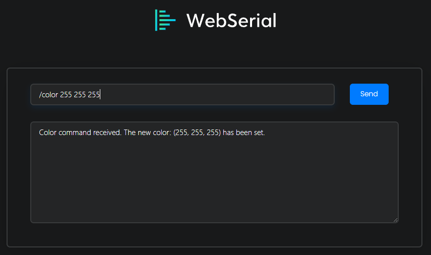
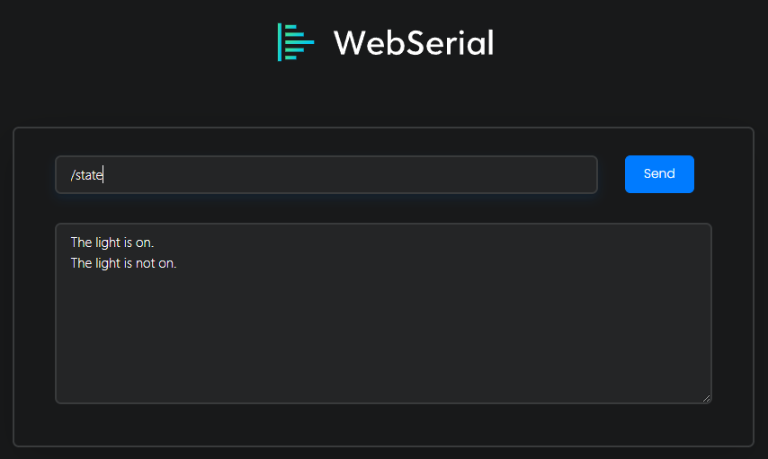

# RotaryHueControl
Control colors on a Common Anode RGB LED diode using a 5 pin 360° rotary encoder and a basic rotary potentiometer, or built-in web interface commands.          

  
  
  
  

## Network Info:
This program requires internet to function - make sure to change the ssid and password variables in main.cpp to match your network settings. You may also need to change the subnet, gateway, and local_ip variables.      

## Functionality:
* 360° Rotary encoder color controls - spinning the rotary encoder will cycle the LED diodes through the color spectrum.
    * Rotary encoder power controls - pressing the rotary encoder's built-in button will toggle the power state of the LED diodes.
* Potentiometer brightness controls - spinning the potentiometer will modify the brightness level of the LED diodes.
* Internet Serial Interface - includes WebSerial library to allow serial monitoring and input over Wi-Fi (http://<espIP>/webserial)
* Internet based controls via WebSerial input:
    * /color r g b - Allows you to set the LED color to a specific RGB value.
    * /state - Reports whether or not the light is on.
    * /restart - restarts the ESP device.
* Internet connection status indicator: Red onboard LED will turn on anytime the ESP is not connected to a Wi-Fi network.
* OTA Updates - includes ElegantOTA library to allow for Over-The-Air firmware updates (http://<espIP>/update).      

# Specifications and Pinout
All builds were created and tested using the PlatformIO IDE extension for VSCode and Espressif ESP8266 NodeMCU board paired with a rotary encoder from an old alarm clock. Mileage may vary using other boards, IDE's, and rotary encoders.          

The following libraries are required (for basic and network functions):
* [Elegant OTA](https://github.com/ayushsharma82/ElegantOTA)
* [WebSerialDark](https://github.com/mwdle/WebSerialDark)
* [EncoderStepCounter](https://github.com/M-Reimer/EncoderStepCounter)
* [ESPAsyncWebServer](https://github.com/me-no-dev/ESPAsyncWebServer)      

## Pinout Info:
* encoderPin1 is the 'a' pin on your rotary encoder. This program uses pin D2 on the ESP8266 NodeMCU.
* encoderPin2 is the 'b' pin on your rotary encoder. This program uses pin D1 on the ESP8266 NodeMCU.
* button is the button pin on your rotary encoder. This program uses D3 on the ESP8266 NodeMCU.
* pot is the output pin on your potentiometer. This program uses A0 (ADC Pin) on the ESP8266 NodeMCU.
* redPin is the red pin on your _Common Anode_ RGB LED diode. This program uses pin D5 on the ESP8266 NodeMCU.
* greenPin is the red pin on your _Common Anode_ RGB LED diode. This program uses pin D6 on the ESP8266 NodeMCU.
* bluePin is the red pin on your _Common Anode_ RGB LED diode. This program uses pin D7 on the ESP8266 NodeMCU.
* errorLED is the pin of your onboard red LED. This program uses pin 16 on the ESP8266 NodeMCU.
